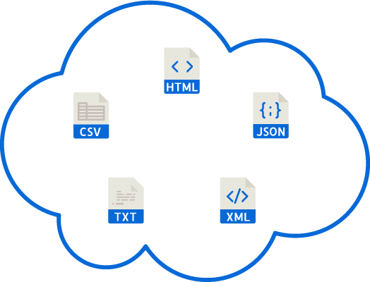

<!DOCTYPE html>
<html lang="en">
  <head>
    <meta charset="utf-8">
    <meta http-equiv="X-UA-Compatible" content="IE=edge">
    <meta name="viewport" content="width=device-width, initial-scale=1">
    <meta name="description" content="">
    <meta name="author" content="">
    <link rel="icon" href="images/pepperbox.ico">

    <title>Pepper-Box Kafka Load Generator</title>

    <!-- Bootstrap core CSS -->
    <link href="css/bootstrap.min.css" rel="stylesheet">

    <!-- IE10 viewport hack for Surface/desktop Windows 8 bug -->
    <link href="css/ie10-viewport-bug-workaround.css" rel="stylesheet">

    <!-- Just for debugging purposes. Don't actually copy these 2 lines! -->
    <!--[if lt IE 9]><![endif]-->
    

    <!-- HTML5 shim and Respond.js for IE8 support of HTML5 elements and media queries -->
    <!--[if lt IE 9]>
      
      
    <![endif]-->

    <!-- Custom styles for this template -->
    <link href="css/carousel.css" rel="stylesheet">
  </head>
<!-- NAVBAR
================================================== -->
  <body>
    

        <nav class="navbar navbar-default navbar-static-top nav-pepper">
          

            

              <button type="button" class="navbar-toggle collapsed" data-toggle="collapse" data-target="#navbar" aria-expanded="false" aria-controls="navbar">
                Toggle navigation
                
                
                
              </button>
              <a class="navbar-brand" href="#">Pepper-Box</a>
            

            

              <ul class="nav navbar-nav">
                <li ><a href="https://github.com/GSLabDev/pepper-box">Getting Started</a></li>
                <li><a href="https://github.com/GSLabDev/pepper-box/wiki">Docs</a></li>
                <li><a href="https://github.com/GSLabDev/pepper-box/issues">Issues</a></li>
                <li >
                  <a href="https://github.com/GSLabDev/pepper-box/archive/v1.0.tar.gz" >Download Release v1.0</a>
                </li>
              </ul>
            

          

          <a href="https://github.com/GSLabDev/pepper-box" class="github-corner"><svg width="60" height="60" viewBox="0 0 250 250" style="fill:#086ad5; color:#fff; position: fixed; top: 0; border: 0; right: 0;"><path d="M0,0 L115,115 L130,115 L142,142 L250,250 L250,0 Z"></path><path d="M128.3,109.0 C113.8,99.7 119.0,89.6 119.0,89.6 C122.0,82.7 120.5,78.6 120.5,78.6 C119.2,72.0 123.4,76.3 123.4,76.3 C127.3,80.9 125.5,87.3 125.5,87.3 C122.9,97.6 130.6,101.9 134.4,103.2" fill="currentColor" style="transform-origin: 130px 106px;" class="octo-arm"></path><path d="M115.0,115.0 C114.9,115.1 118.7,116.5 119.8,115.4 L133.7,101.6 C136.9,99.2 139.9,98.4 142.2,98.6 C133.8,88.0 127.5,74.4 143.8,58.0 C148.5,53.4 154.0,51.2 159.7,51.0 C160.3,49.4 163.2,43.6 171.4,40.1 C171.4,40.1 176.1,42.5 178.8,56.2 C183.1,58.6 187.2,61.8 190.9,65.4 C194.5,69.0 197.7,73.2 200.1,77.6 C213.8,80.2 216.3,84.9 216.3,84.9 C212.7,93.1 206.9,96.0 205.4,96.6 C205.1,102.4 203.0,107.8 198.3,112.5 C181.9,128.9 168.3,122.5 157.7,114.1 C157.9,116.9 156.7,120.9 152.7,124.9 L141.0,136.5 C139.8,137.7 141.6,141.9 141.8,141.8 Z" fill="currentColor" class="octo-body"></path></svg></a>
        </nav>
    

    

      

        

            

        

      

       
    

     

  

     

          

<a href="https://github.com/GSLabDev/pepper-box">Pepper-Box</a> 
    is a Kafka load generator plugin for JMeter. It allows to send kafka messages of type plain text(JSON, XML, CSV or any other custom format) as well as java serialized objects.
    

      

  

 
    

      

      

        

          <h2 class="featurette-heading">Pepper-Box at scale. Generates a million messages per second.</h2>
          
Pepper-Box designed to generate high load on Kafka. It is JMeter plugin hence we can use all features of jmeter and control kafka load. We can also it as console utility without jmeter.

        

        

          
        

      

      

      

        

          <h2 class="featurette-heading">Pepper-Box at data customization. Design message schema using template engine.</h2>
          
Pepper-Box includes template engine for plain text messsages which helps to design schema in any format including JSON, XML, HTML, CSV and many more. Pepper-Box also allows to send java serialized object messages to kafka.

        

        

          
        

      

      

      

        

          <h2 class="featurette-heading">Pepper-Box at security. Supports SSL, Kerberos authentication.</h2>
          
If Kafka broker is designed with data encryption using SSL/TLS and authentication using Kerberos then these securities can be easily configured using simple user interface of Pepper-Box.

        

        

          
        

      

      

 

        

          <h2 class="featurette-heading">Pepper-Box at UI. Simple user interface for kafka producer tuning and for message schema design.</h2>
          
Pepper-Box provides easy interface to design message schema with random data generation template functions. It also provides easy interface to configure Kafka producer parameters. By default we included only required and performance perspective important parameters but you can add any kafka producer parameter.

        

        

          
        

      

      

      <footer>
        
<a href="#">Back to top</a>

        
<a href="https://www.gslab.com/">gslab</a>  |  <a href="http://open.gslab.com/">Open Source @ GS Lab</a>  |  Copyright © 2017 gslab / Pepper-Box. Licensed under  <a href="http://www.apache.org/licenses/LICENSE-2.0">Apache License 2.0</a>

      </footer>

    

    <!-- Bootstrap core JavaScript
    ================================================== -->
    <!-- Placed at the end of the document so the pages load faster -->
    
    
    
    <!-- Just to make our placeholder images work. Don't actually copy the next line! -->
    
    <!-- IE10 viewport hack for Surface/desktop Windows 8 bug -->
    
  </body>
</html>
